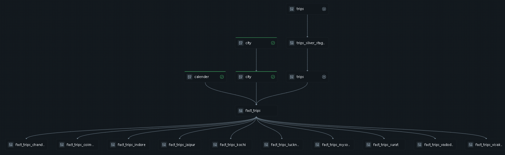

# 🚖 RouteFlow

### Regional Data Pipeline for Transportation Analytics

> A Data Engineering project using **Databricks** | **Medallion Architecture** | **Lakeflow Spark Declarative Pipelines**

---

## 📌 Table of Contents

- [Project Overview](#-project-overview)
- [Problem Statement](#-problem-statement)
- [Technology Stack](#-technology-stack)
- [Project Architecture](#-project-architecture)
- [Key Features](#-key-features)
- [Project Structure](#-project-structure)
- [How to Run](#-how-to-run)
- [Gold Layer Tables](#-gold-layer-tables)
- [Project Outcomes](#-project-outcomes)

---

## 📖 Project Overview

**RouteFlow** is a data engineering project built for **Good Cap**, a fast-growing cab service company operating across multiple cities and regions. The project addresses a critical operational challenge: regional managers were not receiving timely, region-specific data to run daily operations.

The solution adopts a **declarative pipeline approach** using **Databricks Lakeflow Spark Declarative Pipelines** to replace slow, manually orchestrated Spark jobs — delivering faster regional insights, eliminating manual rework, and restoring leadership confidence in the data platform.

---

## ❗ Problem Statement

Good Cap's existing platform relied on **tightly coupled, procedural Spark pipelines with manual orchestration**. This caused three critical failures:

- 📊 Regional managers received **generic dashboards** that were difficult to act on
- 🔄 Teams were forced to **manually export and rework data** for their specific regions
- 🚫 Platform **innovation had stalled**, eroding leadership trust in the data team

The data team was challenged to run a focused pilot proving that a new declarative approach could reduce manual effort, accelerate regional delivery, and demonstrate platform innovation.

---

## ⚙️ Technology Stack

| Component          | Technology                           | Purpose                                |
| ------------------ | ------------------------------------ | -------------------------------------- |
| Data Platform      | Databricks Free Edition              | Core processing, notebooks, pipelines  |
| Pipeline Framework | Lakeflow Spark Declarative Pipelines | Declarative Bronze → Silver → Gold     |
| Storage Layer      | Databricks Volumes (DBFS)            | Replaces AWS S3 for file ingestion     |
| Data Governance    | Unity Catalog                        | Catalog, schema, and access management |
| File Format        | Delta Lake                           | ACID transactions, time travel         |
| Ingestion          | Auto Loader (cloudFiles)             | Incremental CSV file loading           |
| Version Control    | GitHub + Databricks Repos            | Notebook and pipeline versioning       |
| BI & Reporting     | Databricks Dashboards + Genie        | Regional analytics and alerting        |
| Orchestration      | Databricks Jobs & Workflows          | Scheduled pipeline execution           |

---

## 🏗️ Project Architecture

### High-Level Data Flow

```
Trip Data (Simulated CSV Files)
        │
        ▼
Databricks Volumes (routeflow_raw_data)
        │
        ▼
Auto Loader (cloudFiles)
        │
        ▼
┌───────────────────────────────────────────┐
│           Databricks Workspace            │
│                                           │
│   Bronze ──► Silver ──► Gold              │
│                                           │
│   Unity Catalog + Delta Lake              │
│   Lakeflow Spark Declarative Pipelines    │
└───────────────────────────────────────────┘
        │
        ▼
BI Dashboards + Genie + Alerts
```

### Medallion Architecture

| Layer     | Tables                              | Description                                                          |
| --------- | ----------------------------------- | -------------------------------------------------------------------- |
| 🥉 Bronze | raw_trips, raw_cities, raw_calendar | Raw ingestion with Auto Loader, schema rescue, no transformations    |
| 🥈 Silver | trips, cities, calendar             | Cleaned data, type casting, date keys, deduplication, SCD logic      |
| 🥇 Gold   | fact*trips, fact_trips*\<city\>     | BI-ready aggregations, region-partitioned fact tables for dashboards |

### Unity Catalog Structure

```
routeflow_catalog
    └── routeflow_schema
            └── routeflow_raw_data  (Volume - stores CSV files)
            └── bronze              (Schema - raw Delta tables)
            └── silver              (Schema - cleaned Delta tables)
            └── gold                (Schema - BI-ready fact tables)
```

### Project Flow


### Pipeline graph



---

## ✨ Key Features

### 🔷 Declarative Pipelines (Lakeflow SDP)

- Pipelines declare **what to do**, not how to do it
- Spark handles execution planning, dependency management, and incremental processing
- Eliminates manual orchestration from the previous procedural approach

### 🔷 Auto Loader Ingestion

```python
df = (
    spark.readStream.format("cloudFiles")
        .option("cloudFiles.format", "csv")
        .option("cloudFiles.inferColumnTypes", "true")
        .option("cloudFiles.schemaEvolutionMode", "rescue")
        .option("cloudFiles.maxFilesPerTrigger", 100)
        .option("cloudFiles.schemaLocation", SCHEMA_PATH)
        .load(SOURCE_PATH)
)
```

- Reads CSV files directly from **Databricks Volumes**
- Automatically infers column types and handles schema evolution
- Supports **incremental loading** — only processes new files on each run

### 🔷 Region-Partitioned Gold Layer

- Individual fact tables generated **per city**
- Regional managers get fast, pre-aggregated data without manual exports
- Directly connected to Databricks BI Dashboards

### 🔷 Jobs, Workflows & Alerts

- End-to-end pipeline scheduled via **Databricks Jobs**
- BI Dashboards built natively inside the Databricks workspace
- Alerts configured to trigger notifications on pipeline completion or data thresholds

---

## 📁 Project Structure

```
routeflow_transportation_pipeline/
  ├── transformations/
  │     ├── bronze/                     # Auto Loader ingestion notebooks
  │     │     └── city.py
  │     │     └── trips.py
  │     ├── silver/
  │     │     ├── cities.py             # City table transformations
  │     │     ├── calender.py           # Calendar table with date keys
  │     │     └── trips.py              # Trips table cleaning & SCD
  │     └── gold/
  │           └── fact_trips.py         # BI-ready aggregations per region
  │           └── fact_....py
  │           └── fact_....py
  └── project_setup.py
```

---

## 🚀 How to Run

### Step 1: Setup Catalog, Schema & Volume

```sql
-- Run in Databricks notebook
CREATE CATALOG routeflow_catalog;
CREATE SCHEMA routeflow_catalog.routeflow_schema;
CREATE VOLUME routeflow_catalog.routeflow_schema.routeflow_raw_data;
```

### Step 2: Upload CSV Files

- Go to **Data → Volumes → routeflow_raw_data**
- Upload your CSV files: `trips.csv`, `cities.csv`, `calendar.csv`

### Step 3: Connect GitHub Repo

- Go to **Repos** in Databricks workspace
- Add your GitHub repository URL
- Pull the project notebooks into your workspace

### Step 4: Configure Source Path

```python
SOURCE_PATH  = "/Volumes/routeflow_catalog/routeflow_schema/routeflow_raw_data/"
SCHEMA_PATH  = "/Volumes/routeflow_catalog/routeflow_schema/routeflow_raw_data/_schema"
```

### Step 5: Run Pipelines

- Open the **Lakeflow Declarative Pipeline** configuration
- Run Bronze → Silver → Gold in sequence
- Verify tables appear under `routeflow_catalog → routeflow_schema`

### Step 6: Launch Dashboards & Alerts

- Open **Dashboards** in the Databricks workspace
- Connect to Gold layer fact tables
- Configure alerts to trigger notifications on data thresholds

---

## 📊 Gold Layer Tables

Region-specific fact tables generated in the Gold layer:

| Table                      | Region               |
| -------------------------- | -------------------- |
| `fact_trips`               | All regions combined |
| `fact_trips_chandigarh`    | Chandigarh           |
| `fact_trips_coimbatore`    | Coimbatore           |
| `fact_trips_indore`        | Indore               |
| `fact_trips_jaipur`        | Jaipur               |
| `fact_trips_kochi`         | Kochi                |
| `fact_trips_lucknow`       | Lucknow              |
| `fact_trips_mysore`        | Mysore               |
| `fact_trips_surat`         | Surat                |
| `fact_trips_vadodara`      | Vadodara             |
| `fact_trips_visakhapatnam` | Visakhapatnam        |

---

## 🎯 Project Outcomes

| Success Criteria                        | Result                                     |
| --------------------------------------- | ------------------------------------------ |
| Regional managers get faster insights   | ✅ Region-partitioned Gold tables per city |
| Manual data rework eliminated           | ✅ Automated pipeline, no exports needed   |
| Declarative approach demonstrated       | ✅ Lakeflow SDP replaces procedural Spark  |
| Platform innovation shown to leadership | ✅ Dashboards + Genie + Automated alerts   |
| Zero cloud cost solution                | ✅ 100% on Databricks Free Edition         |

---

## 👤 Author

**Project:** RouteFlow — Regional Data Pipeline for Transportation Analytics  
**Domain:** Transportation / Cab Services  
**Platform:** Databricks Free Edition _(No cloud account required)_  
**Architecture:** Medallion (Bronze → Silver → Gold) with Lakeflow Spark Declarative Pipelines

---

> _Built as a learning and portfolio project to demonstrate real-world data engineering skills using modern Databricks tooling._